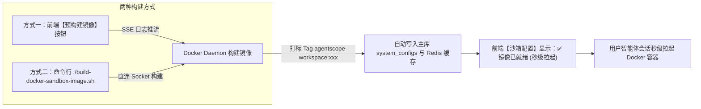

# NanZi AI · Docker 安全代码沙箱预构建与运维指南

本目录收纳 NanZi AI Agent 平台针对 **Docker 策略代码沙箱** 的预构建、环境探测与运维管理工具。

---

## 1. 业务场景与核心用途

### 1.1 为什么智能体需要代码沙箱？
在 NanZi 平台中，智能体具备自主编写并执行代码的能力（例如：**Python 数据分析与图表绘制**、**ChatBI 复杂计算**、**Shell 自动化运维脚本**、**动态文件处理与解压缩**）。

为了保障宿主机与平台核心系统的安全，**绝不能让 AI 生成的代码直接运行在宿主服务器或平台主服务容器内**。
Docker 代码沙箱通过启动相互隔离、非特权的轻量级容器（挂载独立的工作区 `/workspace`，限制 CPU/内存资源与网络访问权限），确保任何代码执行风险均被封堵在容器内部。

### 1.2 为什么必须提前构建镜像？（痛点与加速机制）
* **冷启动痛点**：AgentScope 的 DockerWorkspace 运行时，其镜像 Tag 是基于 Dockerfile 文本、依赖项与网关脚本自动计算的 **SHA256 内容哈希**（如 `agentscope-workspace:c0e8fe730bda`）。如果管理员在部署后未提前预构建，**首位触发代码执行的用户会遭遇长达 2~5 分钟的现场冷启动等待**（平台必须现场拉取基础镜像、安装 uv、下载 Python 网关包），极易引发页面超时或用户流失。
* **预构建加速机制**：提前通过本工具拉取基础环境、安装好 MCP 网关和常用系统排障工具，生成确定性的镜像 Tag 并写入平台缓存。此后所有用户的智能体会话均可**秒级拉起容器（毫秒级响应）**。

---

## 2. 镜像内置环境与排障工具链

预构建生成的沙箱镜像不仅内置了 AgentScope 标准网关微服务（FastMCP，端口 5600），还通过平台动态模板开箱即用注入了常用的排障工具链，彻底消除智能体执行命令时常见的 `command not found`：

| 分类 | 工具清单 | 用途说明 |
| :--- | :--- | :--- |
| **网络诊断** | `curl`, `iputils-ping` (`ping`), `net-tools` (`netstat`, `ifconfig`), `telnet` | 网络连通性测试、端口探测、路由与网络接口排查 |
| **系统与进程** | `procps` (`ps`, `top`, `pkill`, `free`) | 容器内进程状态排查、死锁进程检测、资源占用监控 |
| **代码与文件** | `git`, `tree`, `ripgrep` (`rg`) | 代码拉取与版本查看、工作区目录层级直观展示、正则文本高效检索 |
| **运行与包管理** | `python:3.11`, `uv` | Python 3.11 核心环境、极速虚拟环境与 pip 依赖安装管理 |

---

## 3. 与平台后台系统设置 (SystemConfig) 的联动闭环

Docker 沙箱的构建与平台后台配置管理深度打通，支持 **Web 界面操作** 与 **服务器命令行操作** 双向同步：



### 3.1 平台关键配置项对应
登录管理员控制台，前往 **【系统设置】→【参数配置】→【沙箱配置】**：
* `sandbox_policy`：设为 `docker`（启用 Docker 容器沙箱策略）。
* `sandbox_docker_base_image`：基础镜像名称（留空默认使用官方标准 `python:3.11-slim`；支持替换为企业内部私有 Harbor 镜像加速拉取）。
* `sandbox_docker_prebuild_done`：预构建完成状态标记（系统自动维护，无需手动更改）。

### 3.2 自动状态回填与核验
* 无论是在 Web 控制台点击【预构建镜像】，还是在服务器执行 `./build-docker-sandbox-image.sh`，构建完成后程序均会自动调用平台 API / 数据库服务，将 `sandbox_docker_prebuild_done` 标记写入数据库与 Redis。
* 刷新前端后台页面，即可看到沙箱状态显示为绿色的 **【✅ 镜像已就绪 (秒级拉起)】**。

---

## 4. 命令行操作指南

在平台宿主机或已挂载 Docker Socket 的管理终端中执行：

### 4.1 常用操作速查

```bash
# 1. 演练模式 (Dry-Run)：预览将生成的 Dockerfile 完整内容与排障工具链，不触发实际构建
./sandbox/docker/build-docker-sandbox-image.sh --dry-run

# 2. 探测本地沙箱镜像：扫描 Docker daemon 中现存的所有 agentscope-workspace 镜像及配置匹配状态
./sandbox/docker/build-docker-sandbox-image.sh --list

# 3. 交互式安全构建：无参数执行，先输出配置概览与预装工具链，提示 [y/N] 防误触确认
./sandbox/docker/build-docker-sandbox-image.sh

# 4. 免交互自动化构建：适合 CI/CD 流水线或自动化部署脚本
./sandbox/docker/build-docker-sandbox-image.sh -y

# 5. 检查当前预构建状态与确定性 Tag
./sandbox/docker/build-docker-sandbox-image.sh --status

# 6. 带网络代理构建（解决受限网络环境下无法访问 Astral uv 脚本或外网源的问题）
./sandbox/docker/build-docker-sandbox-image.sh --proxy http://127.0.0.1:7890

# 7. 强制重建（忽略本地缓存，全量重新下载并构建）
./sandbox/docker/build-docker-sandbox-image.sh --force --base-image python:3.11-slim
```

### 4.2 参数说明

| 参数 | 简写 | 说明 |
| :--- | :--- | :--- |
| `--dry-run` | `-n` | 演练模式：仅生成并打印包含排障工具的 Dockerfile 与构建上下文，不调用 Docker API |
| `--list` | `-l` | 探测并表格化列出本地 Docker 中所有 `agentscope-workspace` 镜像及配置匹配状态 |
| `--yes` | `-y` | 跳过无参执行时的交互式确认提示，直接开始构建 |
| `--status` | | 查询当前基础镜像的确定性 Tag、Docker Daemon 连通性与平台就绪状态 |
| `--force` | | 强制重新构建，忽略本地已有镜像缓存 |
| `--base-image` | | 指定构建使用的基础镜像（默认 `python:3.11-slim`） |
| `--proxy` | | 指定构建阶段传递的 `HTTP_PROXY` / `HTTPS_PROXY` 代理地址 |
