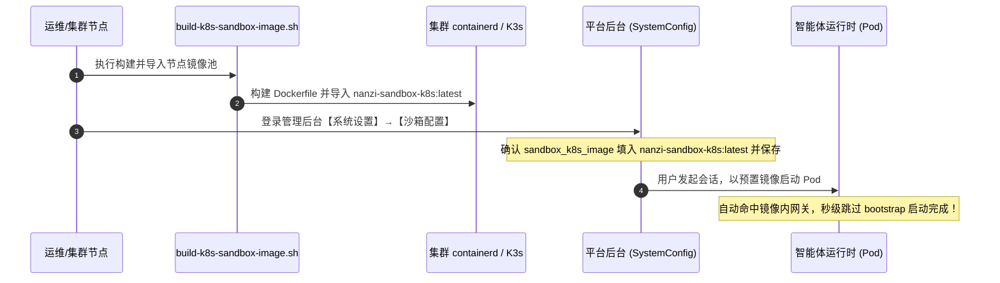

# NanZi AI · K8s 沙箱预置镜像构建与运维指南

本目录收纳 NanZi AI Agent 平台针对 **Kubernetes (K8s) 策略代码沙箱** 的预置镜像构建入口、环境探测与运维指南。

---

## 1. 业务场景与架构区别

### 1.1 云原生生产级多租户沙箱场景
在生产级高可用 Kubernetes 集群中，平台后端多以多副本 Pod 形式部署在工作节点上，出于云原生安全规范，**平台自身容器不具备宿主机的 Docker daemon 权限**。

当用户通过智能体运行 Python 代码、执行大数据统计或 Shell 工具时，平台通过 Kubernetes API 动态将每次代码执行调度为集群内独立的非特权沙箱 Pod（命名规范如 `as-ws-<user_key>-<seq>`），并通过持久卷（PVC）共享用户的工作区历史文件。

### 1.2 为什么要构建预置镜像？（冷启动从数十秒降至秒级的核心秘密）
* **原生 AgentScope K8s 沙箱的痛点**：
  默认情况下，AgentScope 在拉起一个新的 K8s 沙箱 Pod 时，会在容器启动阶段现场执行一遍名为 `bootstrap` 的初始化脚本（在 Pod 的 `/root/.agentscope` 临时层联网执行 `apt-get update`、下载安装 `uv`、安装 `fastapi/uvicorn/mcp/httpx` 等）。
  👉 **直接后果**：每个用户每发起一次新会话，**沙箱 Pod 启动都需要现场等待 30~60 秒**，而且一旦集群节点访问外网源出现波动，就会直接报 `HTTP 500: No module named 'xxx'` 或容器启动超时失败！
* **预置镜像（Prebuilt Image）的提速机制**：
  本脚本通过预先构建一份定制镜像，将完整的网关虚拟环境、AgentScope 工具链依赖包、排障工具以及 `_mcp_gateway_app.py` 脚本模板**直接打死在镜像中**。
  👉 **提速效果**：新 Pod 启动时，AgentScope 检测到镜像内部已有完整的网关模板，**会自动判定网关已初始化，从而彻底跳过整个 bootstrap 流程**，沙箱冷启动时间从 40+ 秒锐减至 **1~2 秒**！

---

## 2. 镜像内置环境与排障工具链

构建生成的 K8s 沙箱镜像包含两大类环境，全面解决沙箱内命令缺失问题：

| 分类 | 预装清单 | 核心用途说明 |
| :--- | :--- | :--- |
| **网络与连接排障** | `curl`, `iputils-ping` (`ping`), `telnet`, `net-tools` (`netstat`, `ifconfig`), `dnsutils` (`dig`, `nslookup`), `iproute2` (`ip`) | 集群内 Service 连通性探测、Pod DNS 解析排查、端口探测与网络排查 |
| **系统、代码与文件** | `procps` (`ps`, `top`, `kill`), `tree`, `less`, `wget`, `git`, `jq`, `unzip` | 进程与负载监控、目录结构查看、大文本翻页、压缩包解压、JSON 格式化处理 |
| **AgentScope 完整工具链** | `mcp`, `uvicorn`, `fastapi`, `httpx`, `docstring_parser`, `jinja2`, `aiofiles`, `tree_sitter`, `tree_sitter_bash`, `python-frontmatter` | 官方原生遗漏的工具链核心依赖全部预置补齐，杜绝沙箱网关报模块缺失 500 错误 |

---

## 3. 与平台后台系统设置 (SystemConfig) 的完整联动闭环

K8s 沙箱镜像的构建与平台后台配置是**解耦且紧密联动**的，完整闭环步骤如下：



### 3.1 步骤一：在节点上执行镜像构建与导入
在可连接 Docker 的构建机或 K8s/K3s 节点上执行：
```bash
./sandbox/k8s/build-k8s-sandbox-image.sh
```
* 脚本会自动完成 Docker build、导出 tar 并自动调用 `k3s ctr images import` 或 `ctr images import` 导入节点镜像池。
* 构建完成后运行 `./sandbox/k8s/build-k8s-sandbox-image.sh --list` 确认镜像已存在。

### 3.2 步骤二：在 Web 控制台绑定镜像参数
1. 登录平台管理员控制台，前往 **【系统设置】→【参数配置】→【沙箱配置】**；
2. 找到配置项 **`sandbox_k8s_image`**（默认为 `nanzi-sandbox-k8s:latest`，若构建时指定了版本号如 `v1.0.0`，请在此填入对应名称）；
3. 确保 **`sandbox_policy`** 选为 `k8s`；
4. 点击右上角 **【保存变更 (⌘S)】**。

### 3.3 步骤三：验证秒级启动效果
回到智能体聊天界面，发起带有 Python 代码执行或 Shell 工具的任务，系统将自动使用该预置镜像拉起沙箱 Pod，冷启动直接秒级就绪！

---

## 4. 命令行操作指南

当前目录的脚本已透明映射至 `k8s_deploy/build-k8s-sandbox-image.sh`：

### 4.1 常用构建与探测命令

```bash
# 1. 演练模式 (Dry-Run)：预览将生成的 Dockerfile 完整内容与构建命令，不执行实际构建
./sandbox/k8s/build-k8s-sandbox-image.sh --dry-run

# 2. 探测本地与节点镜像：扫描 Docker 与集群运行时（containerd/k3s/crictl）已就绪的沙箱镜像
./sandbox/k8s/build-k8s-sandbox-image.sh --list

# 3. 交互式安全构建：无参运行时先打印概览并提示 [y/N] 防误触确认
./sandbox/k8s/build-k8s-sandbox-image.sh

# 4. 免交互直接构建：适合自动化构建部署流水线
./sandbox/k8s/build-k8s-sandbox-image.sh -y

# 5. 指定版本号 Tag 与基础镜像
./sandbox/k8s/build-k8s-sandbox-image.sh --version 1.0.0 --base-image python:3.11-slim

# 6. 带网络代理构建（解决外网访问受限问题）
./sandbox/k8s/build-k8s-sandbox-image.sh --proxy http://127.0.0.1:7890

# 7. 仅构建生成 tar 包，不自动导入节点（适合异地构建后再拷贝导入）
./sandbox/k8s/build-k8s-sandbox-image.sh --no-import
```

---

## 5. 集群沙箱监控与运维联动

平台在根目录下的 [`k8s_deploy/`](../../k8s_deploy/) 目录中提供了完整的生产集群运维总控脚本：

```bash
# 1. 监控沙箱 Pod、沙箱独立 PVC 与共享平台数据卷状态（已自动过滤平台自身 Pod）
./k8s_deploy/nanzi-k8s.sh sandboxes

# 2. 查看集群全组件健康状态
./k8s_deploy/nanzi-k8s.sh health

# 3. 查看平台与沙箱 Pod 事件流（包含 Pod 调度、拉取镜像、挂载失败等详细日志）
./k8s_deploy/nanzi-k8s.sh events
```
